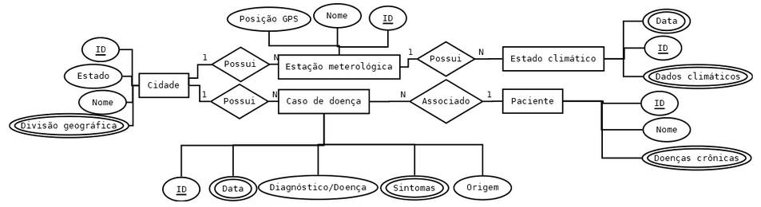
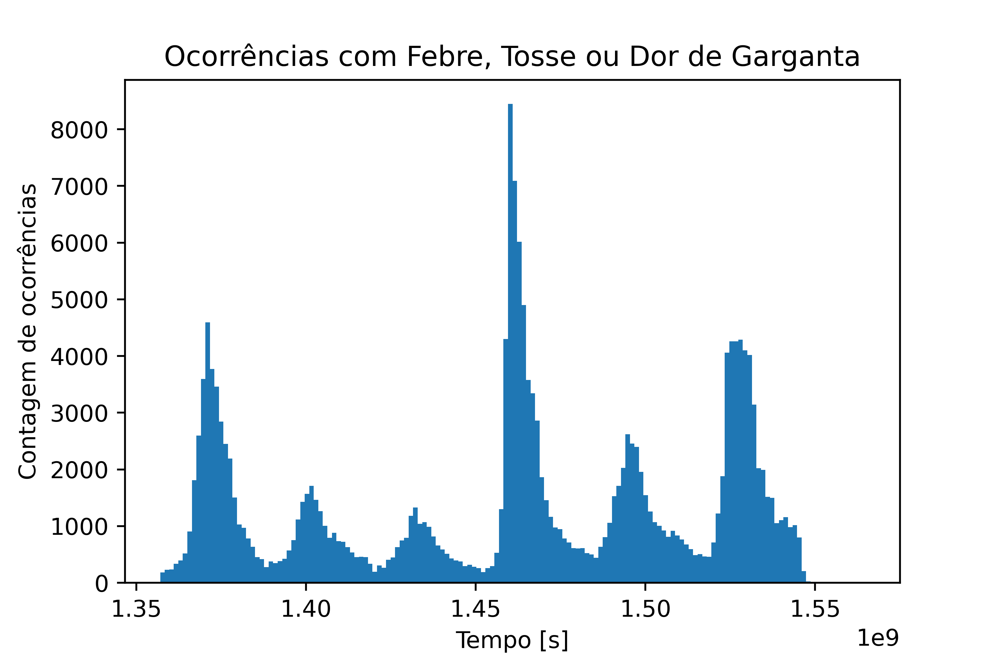

# Projeto Breath - DataBank

# Equipe Breath - BRth
* Gabriel Costa Kinder - 234720
* João Pedro de Moraes Bonucci - 218733
* Elton Cardoso Do Nascimento - 233840
* Lucas Otávio Nascimento de Araújo - 240106

## Resumo do Projeto
O data set consiste em um banco de dados relacional que agrega, Dados climaticos, Dados de qualidade do ar e Dados de doenças respiratórias do território Brasileiro entre os anos de 2000 e 2020 (nem todos os datasets contém todo o periodo). Com isso, ambicionamos encontrar ou fortalecer relações entre condições ambientais e doenças respiratórias no nosso país fornecendo dados específicos por cidade e mês ao longo de anos. Acreditamos que arquitetar um banco de dados que relacione estas dusa características possa gerar análises e predições importantes para a situação de doenças respiratórias no país.

## Slides da Apresentação
[Slides PDF](slides/slides.pdf)

## Modelo Conceitual



## Modelos Lógicos
~~~
SRAG(_id_, DT_NOTIFIC, ID_MUNICIP, SEM_NOT, SG_UF_NOT, DT_SIN_PRI, DT_NASC, NU_IDADE_N, CS_SEXO, CS_GESTANT, CS_RACA, CS_ESCOL_N, SG_UF, ID_MN_RESI, ID_OCUPA_N, VACINA,
	FEBRE, TOSSE, CALAFRIO, DISPNEIA, GARGANTA, ARTRALGIA, MIALGIA, CONJUNTIV, CORIZA, DIARREIA, OUTRO_SIN, OUTRO_DES, CARDIOPATI, PNEUMOPATI, RENAL, HEMOGLOBI,
	IMUNODEPRE, TABAGISMO, METABOLICA, OUT_MORBI, MORB_DESC, HOSPITAL, DT_INTERNA, CO_UF_INTE, CO_MU_INTE, DT_PCR, PCR_AMOSTR, PCR_OUT, PCR_RES, PCR_ETIOL,
	PCR_TIPO_H, PCR_TIPO_N, DT_CULTURA, CULT_AMOST, CULT_OUT, CULT_RES, DT_HEMAGLU, HEMA_RES, HEMA_ETIOL, HEM_TIPO_H, HEM_TIPO_N, DT_RAIOX, RAIOX_RES, RAIOX_OUT,
	CLASSI_FIN, CLASSI_OUT, CRITERIO, TPAUTOCTO, DOENCA_TRA, EVOLUCAO, DT_OBITO, DT_ENCERRA, DT_DIGITA, SRAG2013FINAL, OBES_IMC, OUT_AMOST, DS_OAGEETI, 
	DS_OUTMET, DS_OUTSUB, OUT_ANTIV, DT_COLETA, DT_ENTUTI, DT_ANTIVIR, DT_IFI, DT_OUTMET, DT_PCR_1, DT_SAIDUTI, RES_ADNO, AMOSTRA, HEPATICA, NEUROLOGIC,
	OBESIDADE, PUERPERA, SIND_DOWN, RES_FLUA, RES_FLUB, UTI, IFI, PCR, RES_OUTRO, OUT_METODO, RES_PARA1, RES_PARA2, RES_PARA3, DESC_RESP, SATURACAO, ST_TIPOFI, 
	TIPO_PCR, ANTIVIRAL, SUPORT_VEN, RES_VSR, RES_FLUASU, DT_UT_DOSE)

CLIMA(_id_, date, precipitacao, pressao_at_max, pressao_at_min, radiacao, temp_max, temp_min, umidade, max_vent, velocidade_vent, region, state, 
	station, lat, lon, elvt)

Estacoes(_Id_, Stacao, Regiao, UF, Codigo, Prim_data, alt, lon, lat)

Cidades(_Id_, UF, Nome_UF, Mesorregião Geográfica, Nome_Mesorregião, Microrregião Geográfica, Nome_Microrregião,
	Município, Código Município Completo, Nome_Município, lat, lon)
~~~


## Dataset Publicado

título do arquivo/base | link | breve descrição
----- | ----- | -----
srag_full_cities.csv | [srag_full_cities.csv](https://drive.google.com/file/d/1afwwfCsLYzNcMdGei3BBKOeBc3WGnto-/view?usp=sharing) | Compilação de dados tratados de casos de doenças em postos de saúde SUS ao redor do país de 2013 à 2018, incluindo nome de cidades
clima_sul_processado.csv | [clima_sul_processado.csv](https://drive.google.com/file/d/16cOnwBS8JqDIwOxH_pdcTyQG7L-DSlmf/view?usp=sharing) | Valores por hora de dados do clima da região sul do país
clima_sudeste_processado.csv | [clima_sudeste_processado.csv](https://drive.google.com/file/d/1PofSxREt7spX005JxK5QL59m36fSDtp2/view?usp=sharing) | Valores por hora de dados do clima da região sudeste do país
clima_norte_processado.csv | [clima_norte_processado.csv](https://drive.google.com/file/d/1sgAY6_U1FLTKwv_GDmus6dyGnlzI-m0g/view?usp=sharing) | Valores por hora de dados do clima da região norte do país
clima_nordeste_processado.csv | [clima_nordeste_processado.csv](https://drive.google.com/file/d/1QB3_MoBUZvv9boxWelNyqoNV-uVvupN9/view?usp=sharing) | Valores por hora de dados do clima da região nordeste do país
clima_centro_oeste_processado.csv | [clima_centro_oeste_processado.csv](https://drive.google.com/file/d/17UMWjVsAyCvOVwGsRVw715647DTJbJNL/view?usp=sharing) | Valores por hora de dados do clima da região centro-oeste do país
clima_estacoes_meteo.csv | [clima_estacoes_meteo.csv](https://drive.google.com/file/d/1evGeD76T7Wh0AhlWI34NtRSNHVJWzjYg/view?usp=sharing) | Tabela com todas as estações meteorológicas utilizadas
cidades_brasileiras_editado.csv | [cidades_brasileiras_editado.csv](https://drive.google.com/file/d/1CmzWRbQCrVKaN7g0FZd700IVHFEL2VLS/view?usp=sharing) | Tabela com a geolocalização (latitude e longitude) de grande parte das cidades brasileiras
IBGE_Municipios.csv | [IBGE_Municipios.csv](https://drive.google.com/file/d/1ldijywxW7ZrC3Z-iYX8URVYC7C--h_Mz/view?usp=sharing) | Tabela com o código IBGE de cada município brasileiro, além de outras informações geográficas regionais

## Bases de Dados

título da base | link | breve descrição
----- | ----- | -----
Climate Weather Surface of Brazil - Hourly | [Climate Weather Surface of Brazil - Hourly](https://www.kaggle.com/PROPPG-PPG/hourly-weather-surface-brazil-southeast-region) | Banco de dados com registros climáticos e atmosféricos de estações meteorológicas de todo o brasil com granularidade de hora desde 2000
SRGA Banco de dados síndrome respiratória aguda grave 2013 - 2018 | [SRAG DataSUS 2013-2018](https://opendatasus.saude.gov.br/dataset/bd-srag-2012-a-2018) | Base de dados aberta do SUS sobre todos os diagnósticos e suspeitas de Sindrome Respiratória Aguda Grave desde 2009
Plataforma da Qualidade do Ar | [Qualidade do Ar](http://qualidadedoar.org.br/about) | Base de dados aberta com medição de conscentração de poluentes no ar por região brasileira
Brazilian_cities_database | [Brazilian Cities DB](https://github.com/hewerthomn/brazilian_cities_database/blob/master/cities.sql) | Base de dados aberta com a longitude e latitude da quase totalidade de cidades brasileiras

## Detalhamento do Projeto
> Apresente aqui detalhes do processo de construção do dataset e análise. Nesta seção ou na seção de Perguntas podem aparecer destaques de código como indicado a seguir. Note que foi usada uma técnica de highlight de código, que envolve colocar o nome da linguagem na abertura de um trecho com `~~~`, tal como `~~~python`.
> Os destaques de código devem ser trechos pequenos de poucas linhas, que estejam diretamente ligados a alguma explicação. Não utilize trechos extensos de código. Se algum código funcionar online (tal como um Jupyter Notebook), aqui pode haver links. No caso do Jupyter, preferencialmente para o Binder abrindo diretamente o notebook em questão.

Otimização necessária em Python para a conversão do código do IBGE para nome da cidade
~~~python
    for i in range (len(IBGE['Código Município Completo'])):
        IBGE['Código Município Completo'][i] = str(IBGE['Código Município Completo'][i])[0:6]
        municipdict[IBGE['Código Município Completo'][i]] = IBGE['Nome_Município'][i]

    count = 0
    for i in range(len(srag_full['ID_MUNICIP'])):
        try:
            srag_full['ID_MUNICIP'][i] = municipdict[int(srag_full['ID_MUNICIP'][i])]
~~~

[Tratamento do DataSUS e dados geográficos](src/dataSUS.py)

[Tratamento dos dados do clima e estações metereológicas](src/dados_climaticos.py)

* Extração de dados de fontes online (DataSUS, IBGE, Kaggle, INMET, ...)
* Integração de fontes de dados diferentes
  * Nomes de cidades a partir de códigos do IBGE
  * Obtenção de coordenadas geográficas a partir do nome de cidades
* Tratamento de dados
  * Remoção de cidades inválidas
  * Remoção de dados metereológicos faltantes/inconsistentes
* Transformação de dados
  * Agrupamento de 24 dados por hora para 1 dado equivalente ao dia todo4
  * Padronização de dados em string
  * Remoção de colunas redundantes e não condizentes ao nosso banco


## Evolução do Projeto

Durante a realização do projeto tivemos algumas modificações necessárias: Primeiro reduzimos o intervalo de tempo onde analisamos os dados do SUS, de 2008-2018 para 2013-2018, isso foi uma escolha de projeto devio à inconpatibilidade entre os dados mais antigos e mais novos, e a falta de informações destas tabelas em um modelo mais antigo.

Para os dados climáticos estavamos durante um tempo considerando sua representação em um formato de grafos porém acabamos voltando para um formato relacional devido à dificuldade de integração entre os dois modelos e a falta de vantagens de utilizar um modelo de grafos para nossos dados.

Uma das dificuldades encontradas estava relacionada ao grande volume de dados no qual trabalhamos. Especificamente a tabela de dados do SUS possuí mais de 200 mil linhas, o que tornava muito lento seu tratamento. Quando realizado a operação de troca do código do IBGE para o nome por escrito da cidade, utilizar uma solução simples como 2 loops encadiados simplesmente não funcionava devido à seu alto tempo de execução (O(m\*n)), para isso foi criado uma otimização, como mostrado no capítulo de detalhamento acima, onde transformamos sua execução, através da construção de uma estrutura de dicionário, em O(m+n). 


> Relatório de evolução, descrevendo as evoluções na modelagem do projeto, dificuldades enfrentadas, mudanças de rumo, melhorias e lições aprendidas. Referências aos diagramas, modelos e recortes de mudanças são bem-vindos.
> Podem ser apresentados destaques na evolução dos modelos conceitual e lógico. O modelo inicial e intermediários (quando relevantes) e explicação de refinamentos, mudanças ou evolução do projeto que fundamentaram as decisões.
> Relatar o processo para se alcançar os resultados é tão importante quanto os resultados.

## Perguntas de Pesquisa/Análise Combinadas e Respectivas Análises

> Apresente os resultados da forma mais rica possível, com gráficos e tabelas. Mesmo que o seu código rode online em um notebook, copie para esta parte a figura estática. A referência a código e links para execução online pode ser feita aqui ou na seção de detalhamento do projeto (o que for mais pertinente).

> Liste aqui as perguntas de pesquisa/análise e respectivas análises. Nem todas as perguntas precisam de queries que as implementam. É possível haver perguntas em que a solução é apenas descrita para demonstrar o potencial da base. Abaixo são ilustradas três perguntas, mas pode ser um número maior a critério da equipe.
>
### Perguntas/Análise com Resposta Implementada

> As respostas às perguntas podem devem ser ilustradas da forma mais rica possível com tabelas resultantes, grafos ou gráficos que apresentam os resultados. Os resultados podem ser analisados e comentados. Veja um exemplo de figura ilustrando uma comunidade detectada no Cytoscape:

> 

#### Pergunta/Análise 1

**Existe alguma sazonalidade nos sintomas relacionados a problemas respiratórios?**

Com essa pergunta, queremos confirmar a informação já sabida de que problemas respiratórios como a gripe ocorrem mais durante o inverno. Para responder essa pergunta, realizamos o seguinte processo:

- Extraímos todas as entradas que relatam febre, tosse ou dor de garganta:

```sql
SELECT DT_NOTIFIC FROM SRAG WHERE TOSSE = 1 OR FEBRE = 1 OR GARGANTA = 1;
```

- Convertemos cada entrada de data da tabela SRAG para segundos desde a epoch, criando a coluna "data". Essa etapa foi realizado em Python.
- Montamos um histograma das ocorrências. Essa etapa foi realizada em Python.



Analisando o histograma, podemos observar que os casos se concentram em momentos específicos dos 6 anos representados, mais especificamente no meio deles. Como os dados foram obtidos no Brasil, esse período se refere ao inverno.

Com isso, conseguimos confirmar a informação conhecida, problemas respiratórios são mais presentes durante o inverno.


#### Pergunta/Análise 2
**Quais os sintomas mais comuns?**


Para responder essa pergunta, realizamos a seguinte query:

```sql
SELECT COUNT(<nome_do_sintoma>) FROM SRAG WHERE <nome_do_sintoma> = 1
```
Alterando *nome_do_sintoma*, que é um dos possíveis sintomas na base:

- FEBRE
- TOSSE
- GARGANTA
- DISPNEIA
- MIALGIA
- SATURACAO
- DESC_RESP


#### Pergunta/Análise 3
> * Pergunta 3
>   
>   * Explicação sucinta da análise que será feita e conjunto de queries que
>     responde à pergunta.

### Perguntas/Análise Propostas mas Não Implementadas

#### Pergunta/Análise 1
> * Pergunta 1
>   
>   * Explicação em linhas gerais de como a base pode ser usada para responder esta pergunta e a sua relevância.

#### Pergunta/Análise 2
> * Pergunta 2
>   
>   * Explicação em linhas gerais de como a base pode ser usada para responder esta pergunta e a sua relevância.

#### Pergunta/Análise 3
> * Pergunta 3
>   
>   * Explicação em linhas gerais de como a base pode ser usada para responder esta pergunta e a sua relevância.

> Coloque um link para o arquivo do notebook que executa o conjunto de queries. Ele estará dentro da pasta `notebook`. Se por alguma razão o código não for executável no Jupyter, coloque na pasta `src`. Se as queries forem executadas atraves de uma interface de um SGBD não executável no Jupyter, como o Cypher, apresente na forma de markdown.
