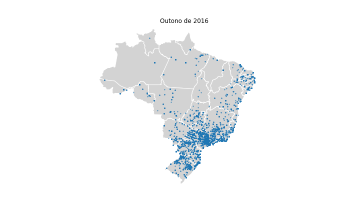
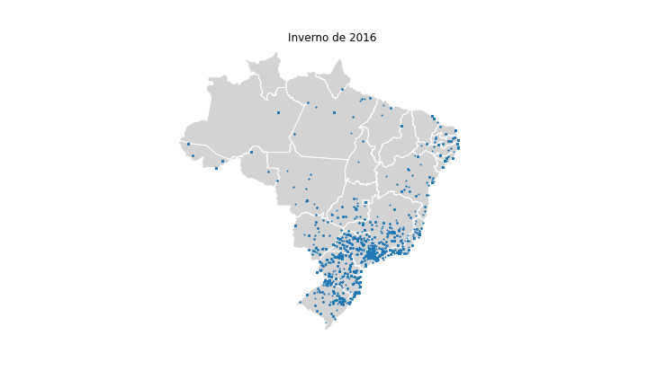
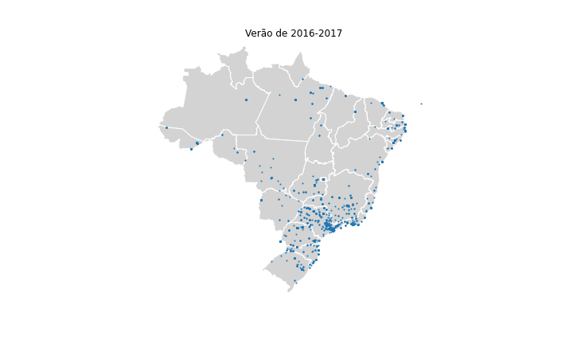
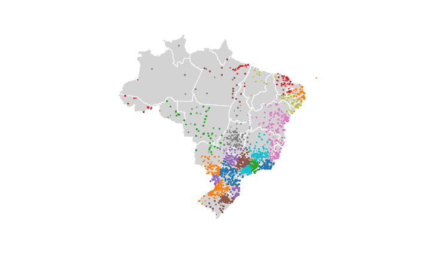
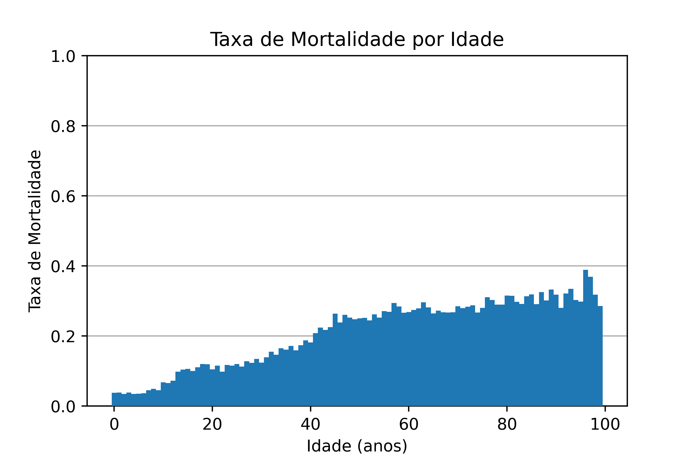
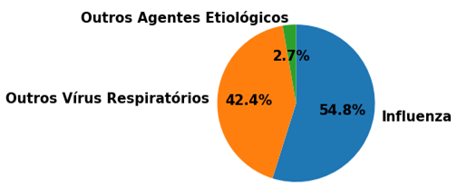

# Projeto Breath - DataBank

# Equipe Breath - BRth
* Gabriel Costa Kinder - 234720
* João Pedro de Moraes Bonucci - 218733
* Elton Cardoso Do Nascimento - 233840
* Lucas Otávio Nascimento de Araújo - 240106

## Resumo do Projeto
O data set consiste em um banco de dados relacional que agrega, Dados climaticos, Dados de qualidade do ar e Dados de doenças respiratórias do território Brasileiro entre os anos de 2000 e 2020 (nem todos os datasets contém todo o periodo). Com isso, ambicionamos encontrar ou fortalecer relações entre condições ambientais e doenças respiratórias no nosso país fornecendo dados específicos por cidade e mês ao longo de anos. Acreditamos que arquitetar um banco de dados que relacione estas dusa características possa gerar análises e predições importantes para a situação de doenças respiratórias no país.

## Slides da Apresentação
[Slides PDF](slides/slides.pdf)

## Modelo Conceitual


## Modelos Lógicos
~~~
SRAG(_id_, DT_NOTIFIC, ID_MUNICIP, SEM_NOT, SG_UF_NOT, DT_SIN_PRI, DT_NASC, NU_IDADE_N, CS_SEXO, CS_GESTANT, CS_RACA, CS_ESCOL_N, SG_UF, ID_MN_RESI, ID_OCUPA_N, VACINA,
	FEBRE, TOSSE, CALAFRIO, DISPNEIA, GARGANTA, ARTRALGIA, MIALGIA, CONJUNTIV, CORIZA, DIARREIA, OUTRO_SIN, OUTRO_DES, CARDIOPATI, PNEUMOPATI, RENAL, HEMOGLOBI,
	IMUNODEPRE, TABAGISMO, METABOLICA, OUT_MORBI, MORB_DESC, HOSPITAL, DT_INTERNA, CO_UF_INTE, CO_MU_INTE, DT_PCR, PCR_AMOSTR, PCR_OUT, PCR_RES, PCR_ETIOL,
	PCR_TIPO_H, PCR_TIPO_N, DT_CULTURA, CULT_AMOST, CULT_OUT, CULT_RES, DT_HEMAGLU, HEMA_RES, HEMA_ETIOL, HEM_TIPO_H, HEM_TIPO_N, DT_RAIOX, RAIOX_RES, RAIOX_OUT,
	CLASSI_FIN, CLASSI_OUT, CRITERIO, TPAUTOCTO, DOENCA_TRA, EVOLUCAO, DT_OBITO, DT_ENCERRA, DT_DIGITA, SRAG2013FINAL, OBES_IMC, OUT_AMOST, DS_OAGEETI, 
	DS_OUTMET, DS_OUTSUB, OUT_ANTIV, DT_COLETA, DT_ENTUTI, DT_ANTIVIR, DT_IFI, DT_OUTMET, DT_PCR_1, DT_SAIDUTI, RES_ADNO, AMOSTRA, HEPATICA, NEUROLOGIC,
	OBESIDADE, PUERPERA, SIND_DOWN, RES_FLUA, RES_FLUB, UTI, IFI, PCR, RES_OUTRO, OUT_METODO, RES_PARA1, RES_PARA2, RES_PARA3, DESC_RESP, SATURACAO, ST_TIPOFI, 
	TIPO_PCR, ANTIVIRAL, SUPORT_VEN, RES_VSR, RES_FLUASU, DT_UT_DOSE)

CLIMA(_id_, date, precipitacao, pressao_at_max, pressao_at_min, radiacao, temp_max, temp_min, umidade, max_vent, velocidade_vent, region, state, 
	station, lat, lon, elvt)

Estacoes(_Id_, Stacao, Regiao, UF, Codigo, Prim_data, alt, lon, lat)

Cidades(_Id_, UF, Nome_UF, Mesorregião Geográfica, Nome_Mesorregião, Microrregião Geográfica, Nome_Microrregião,
	Município, Código Município Completo, Nome_Município, lat, lon)
~~~


## Dataset Publicado

título do arquivo/base | link | breve descrição
----- | ----- | -----
srag_full_cities.csv | [srag_full_cities.csv](https://drive.google.com/file/d/1afwwfCsLYzNcMdGei3BBKOeBc3WGnto-/view?usp=sharing) | Compilação de dados tratados de casos de doenças em postos de saúde SUS ao redor do país de 2013 à 2018, incluindo nome de cidades
south_clean.csv | [south_clean.csv](https://drive.google.com/file/d/1-YdoWALSqoHi0WyLKiZDjHvnPWR3_mG4/view?usp=sharing) | Valores por dia de dados do clima da região sul do país
southeast_clean.csv | [southeast_clean.csv](https://drive.google.com/file/d/1Omvc9rIAaBSBLg25icULs1HkRQmnwvd4/view?usp=sharing) | Valores por dia de dados do clima da região sudeste do país
north_clean.csv.csv | [north_clean.csv](https://drive.google.com/file/d/1mifvSBGct_9FvBBPdS6-cJFq9hZLRtm2/view?usp=sharing) | Valores por dia de dados do clima da região norte do país
northeast_clean.csv.csv | [northeast_clean.csv](https://drive.google.com/file/d/1Fge_Z-B-NDOFCWotXum6mralI4U5bD-W/view?usp=sharing) | Valores por dia de dados do clima da região nordeste do país
central_west_clean.csv | [central_west_clean.csv](https://drive.google.com/file/d/1WWc6DRXzgnIOlyvg7dqzKym1-7Gc3r8Y/view?usp=sharing) | Valores por dia de dados do clima da região centro-oeste do país
clima_estacoes_meteo.csv | [stations.csv](https://drive.google.com/file/d/129yttuUHzRjfvi9QCkPz_da2dwJ3HMQB/view?usp=sharing) | Tabela com todas as estações meteorológicas utilizadas
cidades_brasileiras_editado.csv | [cidades_geo_processado.csv](https://drive.google.com/file/d/1wFUTVmRqbqK55ULQL_fwXRssCbfTC0RI/view?usp=sharing) | Tabela com o código IBGE de cada município brasileiro, além de outras informações geográficas regionais bem como geolocalização (latitude e longitude) de grande parte das cidades brasileiras

## Bases de Dados

título da base | link | breve descrição
----- | ----- | -----
Climate Weather Surface of Brazil - Hourly | [Climate Weather Surface of Brazil - Hourly](https://www.kaggle.com/PROPPG-PPG/hourly-weather-surface-brazil-southeast-region) | Banco de dados com registros climáticos e atmosféricos de estações meteorológicas de todo o brasil com granularidade de hora desde 2000
SRGA Banco de dados síndrome respiratória aguda grave 2013 - 2018 | [SRAG DataSUS 2013-2018](https://opendatasus.saude.gov.br/dataset/bd-srag-2012-a-2018) | Base de dados aberta do SUS sobre todos os diagnósticos e suspeitas de Sindrome Respiratória Aguda Grave desde 2009
Plataforma da Qualidade do Ar | [Qualidade do Ar](http://qualidadedoar.org.br/about) | Base de dados aberta com medição de conscentração de poluentes no ar por região brasileira
Brazilian_cities_database | [Brazilian Cities DB](https://github.com/hewerthomn/brazilian_cities_database/blob/master/cities.sql) | Base de dados aberta com a longitude e latitude da quase totalidade de cidades brasileiras

## Detalhamento do Projeto

Otimização necessária em Python para a conversão do código do IBGE para nome da cidade
~~~python
    for i in range (len(IBGE['Código Município Completo'])):
        IBGE['Código Município Completo'][i] = str(IBGE['Código Município Completo'][i])[0:6]
        municipdict[IBGE['Código Município Completo'][i]] = IBGE['Nome_Município'][i]

    count = 0
    for i in range(len(srag_full['ID_MUNICIP'])):
        try:
            srag_full['ID_MUNICIP'][i] = municipdict[int(srag_full['ID_MUNICIP'][i])]
~~~

[Tratamento do DataSUS e dados geográficos](src/dataSUS.py)

[Tratamento dos dados do clima e estações metereológicas](src/dados_climaticos.py)

* Extração de dados de fontes online (DataSUS, IBGE, Kaggle, INMET, ...)
* Integração de fontes de dados diferentes
  * Nomes de cidades a partir de códigos do IBGE
  * Obtenção de coordenadas geográficas a partir do nome de cidades
* Tratamento de dados
  * Remoção de cidades inválidas
  * Remoção de dados metereológicos faltantes/inconsistentes
* Transformação de dados
  * Agrupamento de 24 dados por hora para 1 dado equivalente ao dia todo4
  * Padronização de dados em string
  * Remoção de colunas redundantes e não condizentes ao nosso banco


## Evolução do Projeto

Durante a realização do projeto tivemos algumas modificações necessárias: Primeiro reduzimos o intervalo de tempo onde analisamos os dados do SUS, de 2008-2018 para 2013-2018, isso foi uma escolha de projeto devio à inconpatibilidade entre os dados mais antigos e mais novos, e a falta de informações destas tabelas em um modelo mais antigo.

Para os dados climáticos estavamos durante um tempo considerando sua representação em um formato de grafos porém acabamos voltando para um formato relacional devido à dificuldade de integração entre os dois modelos e a falta de vantagens de utilizar um modelo de grafos para nossos dados.

Uma das dificuldades encontradas estava relacionada ao grande volume de dados no qual trabalhamos. Especificamente a tabela de dados do SUS possuí mais de 200 mil linhas, o que tornava muito lento seu tratamento. Quando realizado a operação de troca do código do IBGE para o nome por escrito da cidade, utilizar uma solução simples como 2 loops encadiados simplesmente não funcionava devido à seu alto tempo de execução (O(m\*n)), para isso foi criado uma otimização, como mostrado no capítulo de detalhamento acima, onde transformamos sua execução, através da construção de uma estrutura de dicionário, em O(m+n). 

Já para a análise, o grande volume de dados foi um problema. Muitos ambientes tem um limite de tamanho de arquivos que conseguem rodar, e muitas os nossos estavam muito além destes limites, além de que, para rodar nossos algoritmos em nossa própria máquina, estes muitas vezes eram lentos devido à este mesmo volume de manipulação de dados. Além disso, para a visualização dos dados geográficos brasileiros, encontrar a documentação sobre plotting e leitura destes dados é difícil e muito escassa.

Para a criação do banco de dados em SQL em si, o volume de dados foi novamente o maior problema, causando crashes no sistema devido ao alto consumo de memória e demorando muito tempo para finalizar sua execução.


## Perguntas de Pesquisa/Análise Combinadas e Respectivas Análises
### Perguntas/Análise com Resposta Implementada
#### Pergunta/Análise 1

**Existe alguma sazonalidade nos sintomas relacionados a problemas respiratórios?**

Com essa pergunta, queremos confirmar a informação já sabida de que problemas respiratórios como a gripe ocorrem mais durante o inverno. Para responder essa pergunta, realizamos o seguinte processo:

- Extraímos todas as entradas que relatam febre, tosse ou dor de garganta:

```sql
SELECT DT_NOTIFIC FROM SRAG WHERE TOSSE = "1.0" OR FEBRE = "1.0" OR GARGANTA = "1.0";
```

- Convertemos cada entrada de data da tabela SRAG para segundos desde a epoch, criando a coluna "data". Essa etapa foi realizado em Python.
- Montamos um histograma das ocorrências. Essa etapa foi realizada em Python.


Analisando o histograma, podemos observar que os casos se concentram em momentos específicos dos 6 anos representados, mais especificamente no meio deles. Como os dados foram obtidos no Brasil, esse período se refere ao inverno.

Com isso, conseguimos confirmar a informação conhecida, problemas respiratórios são mais presentes durante o inverno.


#### Pergunta/Análise 2
**Quais os sintomas mais comuns?**


Para responder essa pergunta, realizamos a seguinte query:

```sql
SELECT COUNT(FEBRE) FROM SRAG WHERE FEBRE = "1.0";
SELECT COUNT(TOSSE) FROM SRAG WHERE TOSSE = "1.0";
SELECT COUNT(GARGANTA) FROM SRAG WHERE GARGANTA = "1.0";
SELECT COUNT(DISPNEIA) FROM SRAG WHERE DISPNEIA = "1.0";
SELECT COUNT(MIALGIA) FROM SRAG WHERE MIALGIA = "1.0";
SELECT COUNT(SATURACAO) FROM SRAG WHERE SATURACAO = "1.0";
SELECT COUNT(DESC_RESP) FROM SRAG WHERE DESC_RESP = "1.0";
```

```
FEBRE: 169461
TOSSE: 183489
GARGANTA: 38131
DISPNEIA: 164511
MIALGIA: 52384
SATURACAO: 110485
DESC_RESP: 159059
```

Podemos concluir, portanto, que o sintoma mais comum é a tosse.

#### Pergunta/Análise 3
**Quais eram os dados climáticos no dia onde houveram mais casos de SRAG?**

Podemos utilizar 4 selects aninhados para conseguir nossa informação, um para contar quantos casos aconteceram por dia, um para selecionar o valor máximo, um para manter somente o valor da data, e remover o valor maximo de casos, e um final que encontra está mesma data do banco SRAG e encontra ela no banco clima.

Adicionalmente pode-se querer especificar uma cidade nesta query, já que, da forma que está construída, esta imprimiria todos os dados de cada cidade para este dia.

```sql
SELECT * FROM clima WHERE date IN ( 
	SELECT DT_NOTIFIC FROM (
		SELECT DT_NOTIFIC, MAX(cnt) FROM (
			SELECT DT_NOTIFIC, COUNT(*) as 'cnt' FROM SRAG WHERE FEBRE = "1.0" GROUP BY DT_NOTIFIC)));
```
date |  precipitacao | pressao_at_max | pressao_at_min | radiacao | temp_max | temp_min | umidade | max_vent | velocidade_vent | region | state | station | lat | lon | elvt
----- | ----- | ----- | ----- | ----- | ----- | ----- | ----- | ----- | ----- | ----- | ----- | ----- | ----- | ----- | -----
11/04/2016 | 24.8 | 1016.9 | 849.3 | 4148 | 36.8 | 12 | 100 | 18.9 | 8.2 | SE | MG | CAPELINHA | -17.70527777 | -42.38916666 | 948

(Foi mostrado apenas uma cidade como ilustração do funcionamento da query pois o resultado completo seria muito grande)
#### Pergunta/Análise 4
**Existe alguma sazonalidade nos casos de SRAG?**

Com essa pergunta, confirmamos que o aspecto sazonal se aplica aos casos de SRAG como todo, e não só aos relacionados com sintomas gripais.

Confirmamos essa relação analisando a distribuição temporal do número de entradas por todo o período e a distribuição geográfica dos casos pelo Brasil em cada estação de 2016. Os resultados seguem.








#### Pergunta/Análise 5
**Os casos se concentram em alguma região geográfica?**

Utilizando visualização de dados e clusterização, conseguimos analisar a distribuição dos casos pelo país.



Assim, notamos que eles se concentram, principalmente, no Centro-Sul e próximo ao litoral.
Contudo, notamos que essas análises não levaram a uma informação relevante, uma vez que elas apenas evidenciaram a distribuição da população pelo país.

#### Pergunta/Análise 6
**A idade influencia na Taxa de Mortalidade de SRAG?**

Para cada idade, calculamos a respectiva taxa a partir da coluna de evolução da doença.



O resultado confirmou que faixas etárias mais idosas apresentam maior taxa de mortalidade.

#### Pergunta/Análise 7
**Quais são as principais causas de SRAG?**

Contando o número de casos de cada classe, podemos determinar a resposta.
Para exibir resultados mais relevantes, incluímos apenas os que foram especificados (não nulos).



O gráfico mostra que a maioria dos sintomas são causados por Influenza, seguida de outros vírus respiratórios.

#### Pergunta/Análise 8
**A vacinação contra influenza influencia na mortalidade?**

Separamos os casos em dois grupos: os que ocorreram em pessoas vacinadas e em não vacinadas.
Selecionando os casos causados por influenza, comparamos a taxa de mortalidade de cada um, e notamos que os não vacinados apresentam maior mortalidade.

| Grupo Populacional  | Taxa de Mortalidade |
| ------------- | ------------- |
| Vacinados  | 0,11  |
| Não Vacinados  | 0,16  |


### Perguntas/Análise Propostas mas Não Implementadas

#### Pergunta/Análise 1
**Quais os fatores climáticos que mais impactam casos de síndromes respiratórias em curto prazo?**

Através da análise de picos de casos comparado à anormalidades encontradas nos dados climáticos poderíamos encontrar quais fatores climáticos influenciam mais o crescimento de casos graves.

#### Pergunta/Análise 2
**Existem condições específicas que alteram o quadro de SRAG de forma perceptível?**

Realizando uma análise de blocos onde houveram variações climáticas, porém diferentes entre si, poderia se concluir se elas impactam, ou não, o quadro de sintomas de um paciente com SRAG.

#### Pergunta/Análise 3
**Fenômenos geográficos internacionais impactam o quadro de SRAG?**

Analisando períodos conhecidos, como os de occorência de fenômenos como o *El niño* ou o *La niña*, podemos verificar se estes causam um impacto em número incidências ou quadro geral de pacientes de SRAG. 
