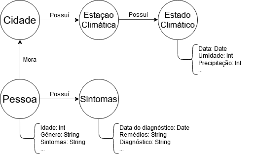

# Equipe Brazilian Research of Atmosphere Towards Health - BReATH
* Gabriel Costa Kinder - 234720
* Elton Cardoso do Nascimento - 233840
* João Pedro de Moraes Bonucci - 218733
* Lucas Otávio Nascimento de Araujo - 240106

## Modelo Lógico Combinado do Banco de Dados de Grafos
> 

## Perguntas de Pesquisa/Análise Combinadas e Respectivas Análises
### Pergunta/Análise 1
> * Pergunta 1
>   
>   * Explicação sucinta da análise que será feita no grafo para atender à pergunta. Deve ser indicado explicitamente em qual das modalidades a análise se encaixa: centralidade; vulnerabilidade; comunidade/modularidade; motifs; predição de links.

### Pergunta/Análise 2
> * Pergunta 2
>   
>   * Explicação sucinta da análise que será feita no grafo para atender à pergunta. Deve ser indicado explicitamente em qual das modalidades a análise se encaixa: centralidade; vulnerabilidade; comunidade/modularidade; motifs; predição de links.

### Pergunta/Análise 3
> * Pergunta 3
>   
>   * Explicação sucinta da análise que será feita no grafo para atender à pergunta. Deve ser indicado explicitamente em qual das modalidades a análise se encaixa: centralidade; vulnerabilidade; comunidade/modularidade; motifs; predição de links.
